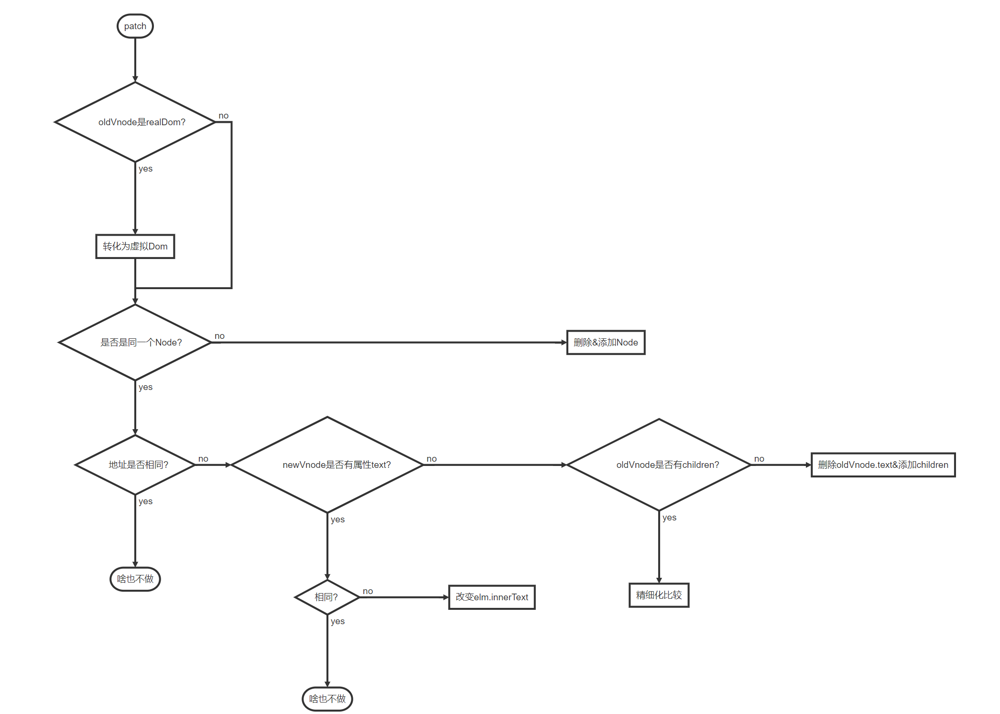

# diff算法主要过程

### 精细化比较

> 设置4个指针分别是**oldFront、oldEnd、newFront、newEnd对应oldvnode和newvnode中前后两个节点**

按照以下方法进行循环比较：

1. while(oldFront<=oldEnd&&newFront<=newEnd)。命中跳2，未命中跳7。
2. 比较oldFront，newFront。未命中向下继续，命中节点都向下移动。
3. 比较oldEnd，newEnd。未命中向下继续，命中节点都向上移动。
4. 比较oldFront，newEnd。未命中向下继续，命中节点，新后上，旧前下。将旧前（标为undefind）指向的节点插入到旧后之后。
5. 比较oldEnd，newFront。未命中向下继续，命中节点，新前下，旧后上。将旧后（标为undefind）指向的节点插入到旧前之前
6. 在oldvnode中遍历newFront，找到后记为undefind，新前下移。没有就新增。跳1。
7. 新节点先执行完，旧节点之间的为删除的。未命中向下，命中结束。
8. 旧节点先执行完，新节点间的为添加的。结束。

